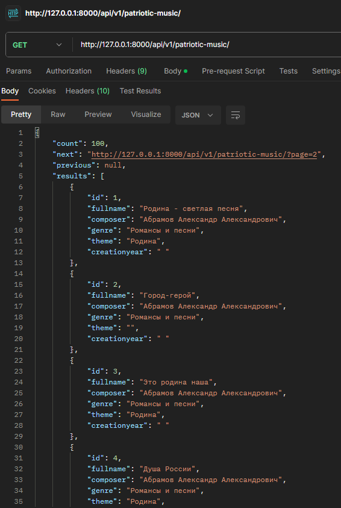

# parsdjangoapi

Парсер сервиса https://opendata.mkrf.ru/opendata на Python, который сохранит данные из таблицы https://opendata.mkrf.ru/opendata/7705851331-patriot_music в базу данных.

HTTP метод всех запросов: GET, POST, PUT DELETE
Формат ответов: JSON

GET: http://127.0.0.1:8000/api/v1/patriotic-music/ запрос возвращает информацию Каталога патриотической музыки(скрин)

{
    "fullname": "",
    "composer": "",
    "genre": "",
    "theme": "",
    "creationyear": ""
}