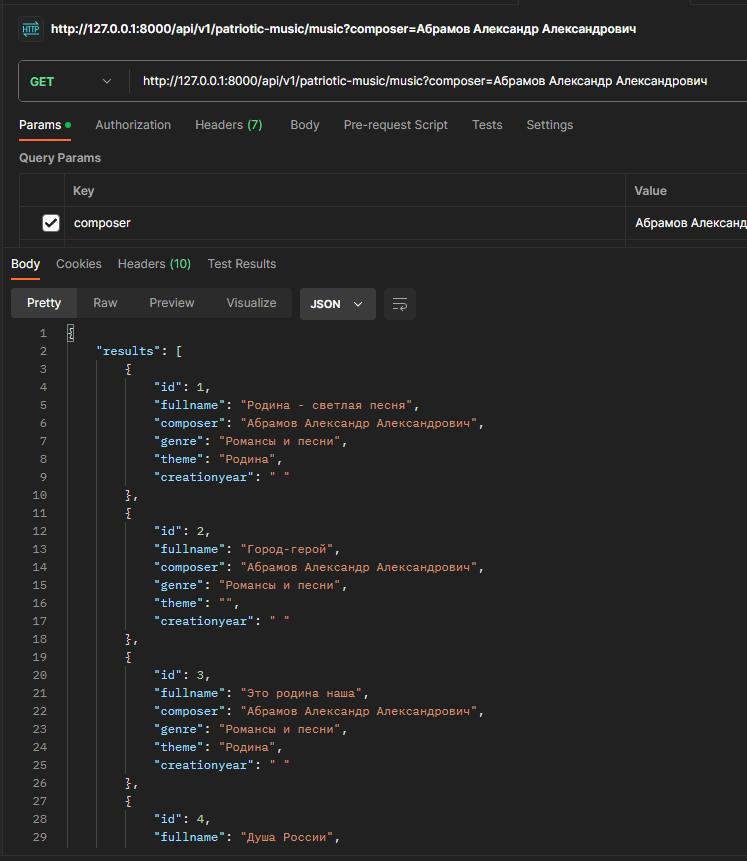

# parsdjangoapi

Парсер сервиса https://opendata.mkrf.ru/opendata на Python, который сохранит данные из
таблицы https://opendata.mkrf.ru/opendata/7705851331-patriot_music в базу данных.

1. Необходимо клонировать репозиторий на локальный ПК, команда "git clone <наименование репозитория>"

2. Установка зависимостей pip install -r .\requirements.txt

3. Запуск миграций python manage.py migrate

4. Запуск сервера python .\manage.py runserver

HTTP метод всех запросов: GET, POST, PUT DELETE
Формат ответов: JSON

GET: http://127.0.0.1:8000/api/v1/patriotic-music/ запрос возвращает информацию Каталога патриотической музыки(скрин img)

POST: http://127.0.0.1:8000/api/v1/patriotic-music/ добавление информации в Каталога патриотической музыки(скрин img_1)

формат добавления JSON
{
    "fullname": "",
    "composer": "",
    "genre": "",
    "theme": "",
    "creationyear": ""
}

GET: http://127.0.0.1:8000/api/v1/patriotic-music?id=1  запрос возвращает информацию Каталога патриотической музыки по
ID(скрин img_2)

PUT: http://127.0.0.1:8000/api/v1/patriotic-music?id=1  изменить информацию Каталога патриотической музыки по
ID

Формат отправки изменений JSON 
{
    "fullname": "fullname",
    "composer": "composer"
}

DELETE: http://127.0.0.1:8000/api/v1/patriotic-music?id=1  удаление информации Каталога патриотической музыки по
ID

Поиск информации в Каталоге патриотической музыки по композитору и жанру. 

GET: http://127.0.0.1:8000/api/v1/patriotic-music/music?composer=<ФИО_композитора> (скрин img_3)

GET: http://127.0.0.1:8000/api/v1/patriotic-music/music?genre=<название_жанра> (скрин img_4)

в файле utils.py если требуется запарсить больше 100 строк в БД необходимо изменить значение 100 на требуемое число (скрин img_5), 
далее запустить миграции python manage.py migrate

